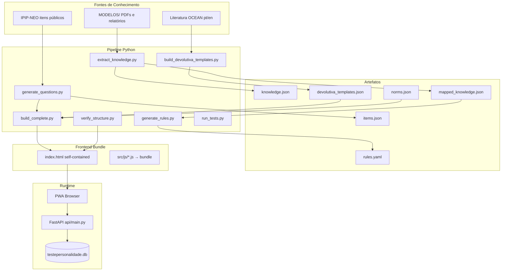
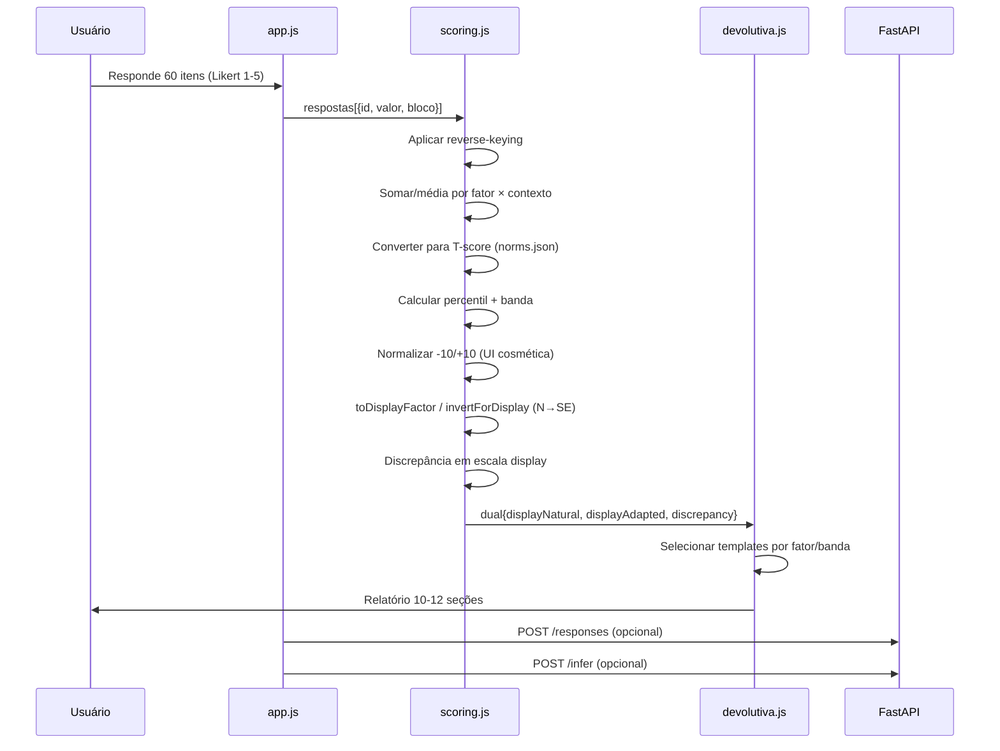
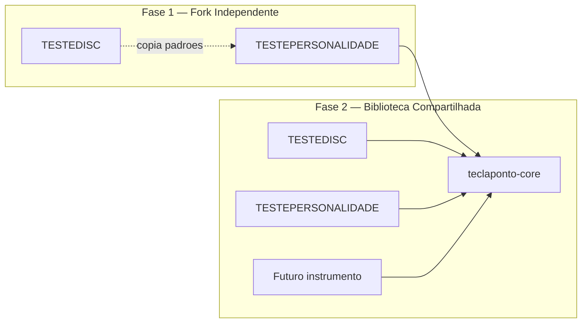

# TESTEPERSONALIDADE — Design do Instrumento Big Five (OCEAN)

| Campo | Valor |
|-------|-------|
| **Autor** | [A definir — TeclaPonto] |
| **Data** | 30 de junho de 2026 |
| **Status** | Draft |
| **Versão alvo** | v1.0.0 |
| **Projeto irmão** | TESTEDISC V2.1.0 (`../TESTEDISC`) |
| **Marca** | TeclaPonto |

---

## Overview

O **TESTEPERSONALIDADE** (Perfil de Personalidade) é um instrumento de autoconhecimento em português brasileiro baseado no modelo **Big Five (OCEAN)**, construído com a **mesma filosofia de pipeline, anti-viés e devolutiva estruturada** do TESTEDISC V2. O usuário responde **60 afirmações** (30 contexto pessoal + 30 contexto profissional, intercaladas), recebe perfis **Natural** e **Adaptado** nos cinco domínios, e um relatório de **10–12 seções** gerado a partir de templates extraídos de corpus de referência.

A arquitetura replica o pipeline `build_all.py` do DISC: extração de conhecimento → templates de devolutiva → geração de itens → regras de interpretação → bundle self-contained → verificação estrutural → testes. O frontend permanece **PWA offline-first**, com dark mode, compartilhamento de resultados e versionamento explícito (`INSTRUMENT_VERSION`).

**Decisão central de formato:** escala **Likert 1–5** (não forced-choice most/least). O DISC usa escolha forçada porque cada questão discrimina quatro fatores simultaneamente; no Big Five cada item mede **um único traço** (com possível reverse-keying). Likert é o padrão psicométrico, reduz fadiga cognitiva e permite normas T-score confiáveis.

---

## Background & Motivation

### Estado atual (TESTEDISC V2.1.0)

O projeto `TESTEDISC` em `C:\Users\offlu\OneDrive\Área de Trabalho\PROJETO DISC V2\TESTEDISC` estabelece um padrão maduro:

| Componente | Implementação DISC | Arquivo(s) |
|------------|-------------------|------------|
| Pipeline | **7 etapas** orquestradas (sem `build_norms.py`) | `build_all.py` |
| Knowledge base | 66 PDFs Thomas → `knowledge.json` | `scripts/extract_knowledge.py` |
| Devolutiva | 12 seções, templates por fator | `scripts/build_devolutiva_templates.py`, `src/js/devolutiva.js` |
| Questões | 28+28 forced-choice | `scripts/generate_questions.py`, `src/js/questions.js` |
| Scoring | Raw ipsativo → normalização -10/+10 | `src/js/scoring.js` |
| Build | Bundle JS (9 módulos, incl. `features.js`) → `index.html` + `docs/` | `build_complete.py` |
| API | FastAPI `/infer`, `/responses`, `/analytics` | `api/main.py` |
| Verificação | **~38 checks** | `verify_structure.py` |
| CI | **`pytest` apenas** (não executa `build_all.py`) | `.github/workflows/ci.yml` |
| Deploy | GitHub Pages via `docs/` | `.github/workflows/pages.yml` |
| Artefato extração | `report_sections.json` | gerado por `extract_knowledge.py` |

### Por que um instrumento OCEAN separado?

1. **Complementaridade:** DISC mede *comportamento observável*; OCEAN mede *traços de personalidade estáveis* — públicos e casos de uso distintos (RH, coaching, autoconhecimento).
2. **Validade psicométrica:** Big Five tem décadas de normas, facetas e literatura; adaptável ao contexto brasileiro sem violar propriedade intelectual de instrumentos proprietários.
3. **Reuso de investimento:** Pipeline, UX anti-viés, PWA, API e padrões de devolutiva já provados no DISC.
4. **Marca TeclaPonto:** Suite de instrumentos com experiência consistente (fluxo linear, pausa neutra, disclaimer clínico).

### Pain points a resolver

- Instrumentos OCEAN em pt-BR são frequentemente traduções literais sem adaptação cultural.
- Relatórios genéricos não contextualizam Natural vs. Adaptado (gap que o DISC já resolve bem).
- Falta de pipeline reprodutível para atualizar itens, normas e devolutivas.

---

## Goals & Non-Goals

### Goals

| ID | Objetivo | Métrica de sucesso |
|----|----------|-------------------|
| G1 | Instrumento OCEAN dual-contexto (Natural/Adaptado) | 60 itens, 6 por fator por contexto |
| G2 | Scoring com normas e faixas interpretáveis | T-score + percentil + banda (5 níveis) |
| G3 | Devolutiva 10–12 seções baseada em corpus | ≥30 documentos de referência processados |
| G4 | Pipeline reprodutível espelhando DISC | `build_all.py` verde localmente; CI roda `pytest` + `verify_structure` incremental |
| G5 | PWA offline + shareable results | Lighthouse PWA ≥80; link `?r={hash}` |
| G6 | API com **mesmos endpoints** DISC | `/infer`, `/responses`, `/result/{hash}` — payload item-level é extensão intencional (ver D16) |
| G7 | Anti-viés UX equivalente ao DISC | Interleaving, `pausaBloco`, `continuarAposPausa`, sem labels de bloco, validação Likert, `sessionId`; rotação de opções DISC = gap intencional (Likert fixo) |
| G8 | Implementação incremental via PRs | 11 PRs ordenados (ver PR Plan); verify checks incrementais |

### Non-Goals (v1.0)

- **Diagnóstico clínico** — disclaimer explícito; não substitui avaliação psicológica.
- **Facetas NEO-PI-R completas** (30 facetas) — adiado para v1.1; v1.0 opera no nível de domínio.
- **Normas brasileiras calibradas em larga escala** — v1.0 usa normas bootstrap (literatura + amostra piloto); recalibração contínua via `/responses`.
- **Monorepo com TESTEDISC** — fork independente na fase 1; extração de `teclaponto-core` apenas quando houver ≥2 instrumentos estáveis.
- **Integração com DISC em relatório único** — produto futuro ("TeclaPonto Suite").

---

## Proposed Design

### Arquitetura geral



### Estrutura de pastas (espelhando TESTEDISC)

```
PERSONALIDADE/
├── build_all.py                    # Orquestrador do pipeline (8 etapas; suporta --step e ALLOW_INCOMPLETE=1)
├── build_complete.py               # Bundle index.html + cópia docs/
├── verify_structure.py             # Verificações incrementais (~15 no PR-01 → ~45 no v1.0)
├── run_tests.py                    # Runner pytest
├── requirements.txt
├── knowledge.json                  # Corpus extraído (relatórios + metadados)
├── index.html                      # Gerado — NÃO editar manualmente
├── manifest.json                   # PWA manifest
├── sw.js.template                  # Template SW ({{INSTRUMENT_VERSION}} injetado no build)
├── sw.js                           # Gerado por build_complete.py — NÃO editar manualmente
│
├── MODELOS/                        # PDFs de relatórios de personalidade (referência)
│   ├── README.md                   # Fontes aceitas, licenças
│   └── ...                         # Meta: 30–50 relatórios (Hogan, NEO interpretive, etc.)
│
├── data/
│   └── testepersonalidade.db       # SQLite (respostas anônimas, resultados compartilhados)
│
├── artifacts/
│   ├── mapped_knowledge.json       # Seções mapeadas por fator OCEAN
│   ├── devolutiva_templates.json   # Templates por fator + seção
│   ├── items.json                  # Banco de itens (fonte IPIP + custom)
│   ├── items_selected.json         # 60 itens selecionados para o instrumento
│   ├── norms.json                  # Tabelas de normas (domínio × sexo × idade opcional)
│   ├── rules.yaml                  # Regras de interpretação composta
│   ├── ontology.yaml               # Definições OCEAN + facetas (v1.1)
│   ├── phrases.json                # Frases auxiliares por banda
│   ├── palavras_por_fator.json     # Vocabulário descritivo por fator
│   └── report_sections.json        # Seções brutas extraídas (espelha DISC)
│
├── scripts/
│   ├── extract_knowledge.py        # Extrai seções dos PDFs em MODELOS/
│   ├── build_devolutiva_templates.py
│   ├── generate_questions.py       # Seleciona/adapta 60 itens IPIP → questions.js
│   ├── generate_rules.py           # Regras por perfil (domínios altos/baixos, gaps)
│   ├── build_norms.py              # Gera/atualiza norms.json (bootstrap + analytics)
│   └── translate_items.py          # Tradução/adaptação pt-BR dos itens IPIP (opcional CI)
│
├── src/js/
│   ├── constants.js                # FACTORES_INTERNOS, FATORES_DISPLAY, CORES, INSTRUMENT_VERSION, bandas
│   ├── questions.js                # PERGUNTAS_NATURAL + PERGUNTAS_ADAPTADO (gerado)
│   ├── palavras-data.js            # Vocabulário por fator (gerado)
│   ├── devolutiva-templates.js     # DEVOLUTIVA_TEMPLATES (gerado)
│   ├── scoring.js                  # Likert scoring, T-scores, dual profile
│   ├── charts.js                   # Radar OCEAN + barras Natural/Adaptado/Δ
│   ├── devolutiva.js               # 10–12 seções do relatório
│   ├── features.js                 # Dark mode, share, PDF, PWA, API
│   └── app.js                      # Fluxo quiz, interleaving, pausa
│
├── api/
│   ├── main.py                     # FastAPI endpoints
│   ├── inference.py                # Motor de regras OCEAN (sem eval)
│   └── database.py                 # SQLite layer
│
├── tests/
│   ├── test_scoring.py
│   ├── test_extraction.py
│   ├── test_inference.py
│   ├── test_norms.py
│   └── test_full_suite.py
│
├── docs/                           # Publicado no GitHub Pages (gerado)
│   ├── index.html
│   ├── manifest.json
│   └── sw.js
│
├── .github/workflows/
│   ├── ci.yml                      # pytest + verify_structure (espelha DISC)
│   └── pages.yml
│
└── DESIGN.md                       # Este documento
```

### Modelo psicométrico OCEAN

#### Domínios e apresentação ao usuário

| Código | Domínio (pt-BR) | Rótulo devolutiva (N invertido) | Cor UI |
|--------|-----------------|--------------------------------|--------|
| **O** | Abertura à Experiência | Abertura à Experiência | `#8E44AD` |
| **C** | Conscienciosidade | Conscienciosidade | `#2980B9` |
| **E** | Extroversão | Extroversão | `#F39C12` |
| **A** | Amabilidade | Amabilidade | `#27AE60` |
| **N** | Neuroticismo *(interno)* | **Estabilidade Emocional** *(usuário)* | `#E74C3C` |

O fator **N** é medido e armazenado **sempre como Neuroticismo** internamente (`FACTORES_INTERNOS = ['O','C','E','A','N']`). A inversão para **Estabilidade Emocional** ocorre **somente na camada de apresentação** via `toDisplayFactor()` — nunca no cálculo de médias, normas ou regras de inferência (ver seção *Representação canônica N / Estabilidade*).

#### Estrutura do instrumento (v1.0)

| Parâmetro | Valor | Justificativa |
|-----------|-------|---------------|
| Total de itens exibidos | **60** | Equilíbrio duração (~12 min) vs. confiabilidade |
| Natural (vida pessoal) | 30 | Espelha `PERGUNTAS_NATURAL` do DISC |
| Adaptado (contexto profissional) | 30 | Espelha `PERGUNTAS_ADAPTADO` |
| Itens por fator por contexto | **6** | 6×5×2 = 60; **12 itens IPIP distintos** por domínio (6 natural + 6 adaptado) |
| Itens por fator total | **12** | Soma dos dois contextos; α **oficial** calculado nos 12 combinados |
| α esperado (12 itens combinados) | **0.70–0.80** | Por contexto (6 itens): 0.60–0.75 — **diagnóstico apenas**, não gate de release |
| Escala de resposta | **Likert 1–5** | "Discordo totalmente" → "Concordo totalmente" |
| Reverse-keyed | **~40%** (24/60) | Padrão IPIP; evita acquiescence bias |
| Facetas (v1.1) | 6 por fator, 2 itens/faceta | NEO-PI-R inspired; não no escopo v1.0 |

#### Facetas (roadmap v1.1 — especificação antecipada)

```yaml
# artifacts/ontology.yaml (estrutura futura)
Abertura:
  facetas: [Fantasia, Estética, Sentimentos, Ações, Ideias, Valores]
Conscienciosidade:
  facetas: [Competência, Ordem, Dever, Esforço, Autodisciplina, Deliberação]
Extroversão:
  facetas: [Cordialidade, Sociabilidade, Assertividade, Atividade, BuscaExcitação, EmoçõesPositivas]
Amabilidade:
  facetas: [Confiança, Franqueza, Altruísmo, Complacência, Modéstia, Sensibilidade]
Neuroticismo:
  facetas: [Ansiedade, Hostilidade, Depressão, Autoconsciência, Impulsividade, Vulnerabilidade]
```

---

### Pipeline — scripts e responsabilidades

Espelha `TESTEDISC/build_all.py` com **8 etapas** (DISC tem 7 — PERSONALIDADE adiciona `build_norms.py`):

```python
# build_all.py — etapas PERSONALIDADE
steps = [
    ("scripts/extract_knowledge.py",      "Extração PDFs MODELOS/"),
    ("scripts/build_devolutiva_templates.py", "Base devolutivas"),
    ("scripts/generate_questions.py",     "Seleção 60 itens IPIP pt-BR"),
    ("scripts/build_norms.py",          "Normas bootstrap T-score"),
    ("scripts/generate_rules.py",       "Regras interpretação OCEAN"),
    ("build_complete.py",               "Build index.html"),
    ("verify_structure.py",             "Auditoria estrutural"),
    ("run_tests.py",                    "Testes pytest"),
]
```

#### Execução incremental (evita pipeline vermelho entre PRs)

```python
# build_all.py — suporte a desenvolvimento parcial
import os, sys

ALLOW_INCOMPLETE = os.environ.get("ALLOW_INCOMPLETE") == "1"

def run_step(script: str) -> int:
    if ALLOW_INCOMPLETE and not Path(script).exists():
        print(f"⏭ SKIP (stub ausente): {script}")
        return 0
    ...

# CLI: python build_all.py --step generate_questions
# CI (PR-01 a PR-09): ALLOW_INCOMPLETE=1 pytest + verify_structure
# Release (PR-10): build_all.py sem ALLOW_INCOMPLETE → 8/8 verdes
```

**Gates de pipeline verde:**

| Gate | Após PR | O que funciona |
|------|---------|----------------|
| G1 | PR-01 | Build HTML stub + verify básico + CI |
| G2 | PR-04 | Scoring offline end-to-end (sem devolutiva) |
| G3 | PR-07 | Relatório frontend completo (sem API) |
| G4 | PR-08 | API + inferência |
| G5 | PR-10 | `build_all.py` completo sem `ALLOW_INCOMPLETE` |

#### Checks `verify_structure.py` (adicionados incrementalmente)

| PR | Checks novos (exemplos) |
|----|-------------------------|
| PR-01 | Arquivos base; bundle 9 módulos JS; `continuarAposPausa`; `features.js`; `sw.js` cache == `INSTRUMENT_VERSION` |
| PR-02 | `items.json` 120 itens; `ipip_source` válido por domínio |
| PR-02b | `items_reviewed.json` com `status: approved` |
| PR-03 | 30 natural + 30 adaptado; `ITEM_MAP` 60 ids; zero `ipip_source` cross-bloco; sem stems duplicados; `validarRespostaLikert` |
| PR-04 | `norms.json`; `classificarBandaT`, `FACTORES_INTERNOS`; boundary T 43/44/56/57 |
| PR-05 | `mapped_knowledge.json`, `report_sections.json` |
| PR-06 | `devolutiva_templates.json`; `selectTemplateKey` fixture alto-N (T=66) → `muito_alto_N` |
| PR-07 | `DEVOLUTIVA_TEMPLATES` no bundle; seções devolutiva |
| PR-08 | `rules.yaml` sem `*_natural_t`; `save_responses_batch`; shared_results schema |
| PR-09 | `sw.js` cache versionado; `test_integration.py` passa |
| PR-10 | `index.html == docs/index.html`; `build_all` 8/8; total ~45 checks |

| Script | Entrada | Saída | Responsabilidade |
|--------|---------|-------|------------------|
| `extract_knowledge.py` | `MODELOS/*.pdf`, `knowledge.json` | `mapped_knowledge.json`, `knowledge.json` | Regex de seções OCEAN (autoimagem, trabalho, relações, estresse, etc.) |
| `build_devolutiva_templates.py` | `mapped_knowledge.json` | `devolutiva_templates.json`, `src/js/devolutiva-templates.js`, `palavras_por_fator.json` | Agrupa texto por fator O/C/E/A/N com keywords |
| `generate_questions.py` | `artifacts/items.json` (IPIP pool) | `items_selected.json`, `src/js/questions.js` | Seleciona 6 itens/fator/contexto; marca `reversed`; adapta wording profissional |
| `build_norms.py` | Literatura + `data/*.db` analytics | `artifacts/norms.json` | Média/DP por domínio; tabelas T-score |
| `generate_rules.py` | `mapped_knowledge.json` | `artifacts/rules.yaml` | Regras "O alto + C alto + A baixo" etc. |
| `build_complete.py` | `src/js/*.js`, `sw.js.template` | `index.html`, `sw.js`, `docs/*` | Bundle self-contained + injeção SW |
| `verify_structure.py` | Todo o projeto | stdout exit 0/1 | Checks incrementais por PR (~15 → ~45) |
| `run_tests.py` | `tests/` | pytest report | Scoring, norms, API, extração |

---

### Estratégia de geração de questões

#### Fonte de itens: IPIP-NEO (domínio público)

1. **Pool inicial:** 120 itens IPIP-NEO-120 ([ipip.ori.org](https://ipip.ori.org)) — 24 itens por domínio (O, C, E, A, N).
2. **Tradução:** `scripts/translate_items.py` produz rascunho pt-BR.
3. **Gate de revisão humana (PR-02b):** traduções revisadas manualmente **antes** de `generate_questions.py` consumir o pool. Checklist obrigatório: clareza pt-BR, equivalência semântica, tom neutro, sem jargão clínico.
4. **Estratégia de pareamento Natural/Adaptado (D13):** **12 itens IPIP distintos por domínio** — 6 alocados ao bloco natural, 6 ao bloco adaptado. **Proibido** reutilizar o mesmo `ipip_source` nos dois blocos. **Proibido** adaptação por sufixo apenas (ex.: mesmo stem + "no trabalho"); cada contexto recebe itens com redação independente, pareados por faceta quando possível (ex.: natural `O1`/Fantasia ↔ adaptado `O2`/Fantasia).
5. **Seleção:** algoritmo em `generate_questions.py`:
   - 6 itens por fator por contexto (12 distintos por domínio no total)
   - ≥2 reverse-keyed por fator por contexto
   - ≥1 faceta representada por contexto (quando metadata IPIP disponível)
   - **Sem `ipip_source` duplicado** entre natural e adaptado
   - **Sem stems duplicados** (`texto` normalizado); distância mínima entre pares do mesmo domínio
   - Exclusão pós-piloto: correlação item-total < 0.20 — **máximo 1 item removido por domínio** em v1.0 (mínimo 5 itens/contexto permanecem)
   - `id` pattern: `n01`–`n30` (natural), `a01`–`a30` (adaptado)

#### Schema `ipip_source` (alinhado a ipip.ori.org)

Formato: `{Domain}{ItemNumber}` onde Domain ∈ {O, C, E, A, N} e ItemNumber ∈ 1..24.

| Domínio | Exemplos válidos | Inválido |
|---------|------------------|----------|
| Abertura | `O1`, `O6`, `O24` | `N6` para item de Abertura |
| Neuroticismo | `N1`, `N6` | `O6` para item de Neuroticismo |

Cada entrada em `artifacts/items.json` inclui: `ipip_source`, `domain`, `facet`, `keyed` (`+` ou `-`), `text_en`, `text_pt`.

#### Anti-viés UX (réplica DISC)

Implementação em `src/js/app.js`, espelhando `TESTEDISC/src/js/app.js`:

```javascript
// Interleaving Natural + Adaptado (sem revelar bloco)
function perguntasEmbaralhadas() {
  const natural = shuffleArray(PERGUNTAS_NATURAL.map((q, i) => prepararQuestao(q, i)));
  const adaptado = shuffleArray(PERGUNTAS_ADAPTADO.map((q, i) => prepararQuestao(q, i)));
  const slots = shuffleArray([...Array(TOTAL_QUESTOES).keys()]);
  const natSlots = slots.slice(0, TOTAL_POR_BLOCO).sort((a, b) => a - b);
  const adpSlots = slots.slice(TOTAL_POR_BLOCO).sort((a, b) => a - b);
  const merged = new Array(TOTAL_QUESTOES);
  natural.forEach((q, i) => { merged[natSlots[i]] = q; });
  adaptado.forEach((q, i) => { merged[adpSlots[i]] = q; });
  return merged;
}
```

| Mecanismo anti-viés | DISC | PERSONALIDADE |
|---------------------|------|---------------|
| Interleaving natural/adaptado | ✅ | ✅ |
| Shuffle ordem questões | ✅ | ✅ |
| Sem label de bloco/tema | ✅ | ✅ |
| Pausa neutra no midpoint | ✅ (28/56) | ✅ (30/60) |
| Rotação de opções | Shuffle DISC opts | N/A (Likert fixo 1–5, ordem sempre Discordo→Concordo) |
| Reverse-keyed itens | N/A | ✅ (~40%) |
| `state.sessionId` (UUID) | ✅ `app.js` L8 | ✅ `crypto.randomUUID()` em `app.js` |
| Validação antes de avançar | `validarRespostaQuestao()` most/least | `validarRespostaLikert()` — valor 1–5 obrigatório |
| Seção `pausaBloco` no HTML | ✅ `build_complete.py` L94–100 | ✅ cópia com `TOTAL_POR_BLOCO`/`TOTAL_QUESTOES` dinâmicos (30/60) |
| `continuarAposPausa()` | ✅ | ✅ + check em `verify_structure.py` |
| Navegação voltar através da pausa | ✅ `voltar()` L136–145 | ✅ mesma lógica |
| Rotação de opções (`prepararQuestao` rotOffset) | ✅ | **N/A intencional** — Likert 1–5 fixo (G7) |

**Nota Likert:** a escala 1–5 é fixa e padronizada (não embaralhar labels — prejudica validade). O anti-viés vem do interleaving, ordem aleatória de itens, itens distintos por contexto e mix de itens diretos/reversos.

#### Critérios de aceite G7 (verificáveis)

- `verify_structure.py` confirma presença de `continuarAposPausa`, `pausaBloco`, `validarRespostaLikert` no bundle.
- Quiz UI **não** exibe labels `natural`/`adaptado` nem nomes de fatores.
- Pausa dispara exatamente em `TOTAL_POR_BLOCO` (30), com copy dinâmico: `"Você completou ${TOTAL_POR_BLOCO} de ${TOTAL_QUESTOES} afirmações"`.
- Teste manual: `voltar()` da questão 31 retorna à pausa; `voltar()` da questão 30 retorna à questão 29.

#### Schema de item (`artifacts/items_selected.json`)

```json
{
  "meta": {
    "instrument_version": "1.0.0",
    "source": "IPIP-NEO-120 + custom",
    "total_items": 60,
    "items_per_factor_per_context": 6
  },
  "items": [
    {
      "id": "n01",
      "bloco": "natural",
      "texto": "Tenho uma imaginação vívida.",
      "fator": "O",
      "faceta": "Fantasia",
      "reversed": false,
      "ipip_source": "O1",
      "theme": "criatividade"
    },
    {
      "id": "n02",
      "bloco": "natural",
      "texto": "Não me interesso por ideias abstratas.",
      "fator": "O",
      "faceta": "Ideias",
      "reversed": true,
      "ipip_source": "O6",
      "theme": "interesse_intelectual"
    },
    {
      "id": "a15",
      "bloco": "adaptado",
      "texto": "No trabalho, busco abordagens criativas para resolver problemas.",
      "fator": "O",
      "faceta": "Fantasia",
      "reversed": false,
      "ipip_source": "O2",
      "theme": "criatividade_profissional"
    }
  ]
}
```

---

### Export de metadados — `questions.js` e `ITEM_MAP`

`scripts/generate_questions.py` gera `src/js/questions.js` com três exports consumidos por `scoring.js` e `app.js`:

```javascript
// questions.js (gerado — não editar manualmente)
const PERGUNTAS_NATURAL = [ /* 30 itens */ ];
const PERGUNTAS_ADAPTADO = [ /* 30 itens */ ];
const PERGUNTAS_ALL = [...PERGUNTAS_NATURAL, ...PERGUNTAS_ADAPTADO];
const ITEM_MAP = Object.fromEntries(PERGUNTAS_ALL.map(q => [q.id, {
  id: q.id,
  fator: q.fator,       // O, C, E, A, N (interno)
  bloco: q.bloco,       // natural | adaptado
  reversed: q.reversed,
  ipip_source: q.ipip_source,
}]));
const TOTAL_POR_BLOCO = 30;
```

`verify_structure.py` valida: (1) 60 ids únicos em `ITEM_MAP`; (2) correspondência 1:1 com `artifacts/items_selected.json`; (3) 6 itens/fator/bloco; (4) zero `ipip_source` compartilhado entre blocos.

---

### Algoritmo de scoring

#### Representação canônica N / Estabilidade Emocional

**Regra:** todo cálculo interno usa **Neuroticismo (N)** com semântica padrão (alto N = alta vulnerabilidade emocional). A inversão para **Estabilidade Emocional (SE)** ocorre **exclusivamente** na camada de apresentação.

```javascript
// constants.js
const FACTORES_INTERNOS = ['O', 'C', 'E', 'A', 'N'];
const FACTORES = FACTORES_INTERNOS;  // alias legado — scoring usa FACTORES_INTERNOS
const FATORES_DISPLAY = ['O', 'C', 'E', 'A', 'SE'];  // SE substitui N na UI
const DISPLAY_LABELS = { O: 'Abertura', C: 'Conscienciosidade', E: 'Extroversão', A: 'Amabilidade', SE: 'Estabilidade Emocional' };

// Limiares T-score — fonte única para bandas, regras e devolutiva (D14, D23)
const BANDA_T_LIMIARES = {
  muito_baixo: { max: 37.9 },
  baixo:       { min: 38, max: 43.9 },
  medio:       { min: 44, max: 56.9 },
  alto:        { min: 57, max: 62.9 },
  muito_alto:  { min: 63 },
};

function toDisplayFactor(f) { return f === 'N' ? 'SE' : f; }

function invertForDisplay(f, scores) {
  // scores: { mean, tScore, percentil, ui } — sempre em escala N interna
  if (f !== 'N') return { ...scores, displayFactor: f };
  return {
    mean: 6 - scores.mean,           // inverte escala Likert 1-5
    tScore: 100 - scores.tScore,
    percentil: 100 - scores.percentil,
    ui: -scores.ui,
    displayFactor: 'SE',
    label: 'Estabilidade Emocional',
  };
}

function classificarBandaT(tScore) {
  if (tScore < 38) return 'Muito Baixo';
  if (tScore < 44) return 'Baixo';
  if (tScore < 57) return 'Médio';
  if (tScore < 63) return 'Alto';
  return 'Muito Alto';
}

function classificarBandaDisplay(f, tScoreInterno) {
  // Para N: banda display (SE) deriva do T-score interno invertido
  const tDisplay = f === 'N' ? (100 - tScoreInterno) : tScoreInterno;
  return classificarBandaT(tDisplay);
}
```

**Onde aplicar inversão:** radar, barras, badges, templates de devolutiva (via `selectTemplateKey`), textos de discrepância para o slot SE, e resposta API `display_scores`. **Onde NÃO inverter:** `calcularRaw`, `toTScore`, `rules.yaml`, variáveis `N_natural`/`N_adapted` em `inference.py` (T-score neuroticismo-canônico).

#### Escala única para bandas e regras (D14, D23)

**Decisão:** **uma única taxonomia de bandas** derivada de T-score via `classificarBandaT()`. Regras em `rules.yaml`, labels de devolutiva, badges e `internal[f].banda` usam **os mesmos limiares T**. Percentil é **derivado** de T (`toPercentile(tScore)`) para exibição informativa — **não** define bandas independentemente. A escala UI `-10/+10` é **cosmética** (D8).

**Sintaxe canônica de variáveis em regras (D14):** `O_natural`, `C_adapted`, `N_diff`, etc. — cada variável `*_natural`/`*_adapted` **já é T-score** (populado por `build_context()`). Alias opcional: `O_t` ≡ `O_natural` (natural default). **Proibido:** sufixo `_t` duplicado (`O_natural_t` não existe no parser).

#### Tabela de conversão entre escalas

| Likert mean (1–5) | T-score (ex. O, μ=3.35 σ=0.72) | Percentil (derivado) | Banda (`classificarBandaT`) | UI (-10/+10) |
|-------------------|-------------------------------|----------------------|----------------------------|--------------|
| 1.0 | ~17 | ~1 | Muito Baixo | -10.0 |
| 2.0 | ~31 | ~12 | Muito Baixo | -5.0 |
| 2.5 | ~38 | ~18 | Baixo | -2.5 |
| 3.0 | ~50 | ~50 | Médio | 0.0 |
| 3.5 | ~52 | ~58 | Médio | +2.5 |
| 4.0 | ~59 | ~73 | Alto | +5.0 |
| 4.5 | ~66 | ~86 | Muito Alto | +7.5 |
| 5.0 | ~73 | ~95 | Muito Alto | +10.0 |

*UI deriva de `((mean - 3) / 2) * 10` — **não norm-referenced**. DISC normaliza contagem ipsativa; escalas UI são visualmente similares mas semanticamente distintas (D8).*

**Limiares T-score (fonte única — regras + UI + devolutiva):**

| Banda | T-score | Exemplo regra YAML |
|-------|---------|-------------------|
| Muito Baixo | < 38 | `O_natural < 38` |
| Baixo | 38 ≤ T < 44 | `N_adapted >= 38` |
| Médio | 44 ≤ T < 57 | `C_natural >= 44` e `C_natural < 57` |
| Alto | 57 ≤ T < 63 | `O_natural >= 57` |
| Muito Alto | ≥ 63 | `E_natural >= 63` |

**Testes de boundary obrigatórios (PR-04):** T = 43.9 → Baixo; T = 44 → Médio; T = 56.9 → Médio; T = 57 → Alto — regra e `classificarBandaT` concordam.

Exemplo canônico: `O_natural >= 57` (Alto), **não** `O_natural > 5` nem `O_natural_t > 57`.

#### Fluxo de dados



#### Passo 1 — Pontuação por item

```javascript
// scoring.js
function pontuarItem(item, respostaLikert) {
  // respostaLikert: 1..5
  const raw = item.reversed ? (6 - respostaLikert) : respostaLikert;
  return raw; // range 1..5 por item
}
```

#### Passo 2 — Raw por fator e contexto

```javascript
function calcularRaw(respostas, bloco) {
  const raw = { O: 0, C: 0, E: 0, A: 0, N: 0 };
  const counts = { O: 0, C: 0, E: 0, A: 0, N: 0 };
  respostas.filter(r => r.bloco === bloco).forEach(r => {
    const item = ITEM_MAP[r.id];
    raw[item.fator] += pontuarItem(item, r.valor);
    counts[item.fator]++;
  });
  // Média 1..5 por fator
  const means = {};
  FACTORES_INTERNOS.forEach(f => { means[f] = raw[f] / counts[f]; });
  return { raw, means, counts };
}
```

#### Passo 3 — T-score e percentil

Normas em `artifacts/norms.json`:

```json
{
  "meta": {
    "version": "1.0.0",
    "sample_size": 500,
    "source": "bootstrap_literature_2026",
    "population": "adultos_brasil_18_65"
  },
  "domains": {
    "O": { "mean": 3.35, "sd": 0.72 },
    "C":   { "mean": 3.52, "sd": 0.68 },
    "E":   { "mean": 3.18, "sd": 0.75 },
    "A":   { "mean": 3.61, "sd": 0.65 },
    "N":   { "mean": 2.89, "sd": 0.78 }
  }
}
```

```javascript
function toTScore(mean, fator) {
  const { mean: mu, sd } = NORMS.domains[fator];
  const z = (mean - mu) / sd;
  return Math.round((50 + 10 * z) * 10) / 10; // T-score clássico
}

function toPercentile(tScore) {
  const z = (tScore - 50) / 10;
  return Math.round(normalCDF(z) * 100);  // ver D18: implementação
}
```

`normalCDF(z)`: **lookup table** estática em `constants.js` (101 entradas, z ∈ [-3.0, +3.0], passo 0.06) — sem dependência externa, determinística em offline/PWA.

#### Passo 4 — Normalização UI (-10 a +10, cosmética)

```javascript
function normalizeForUI(mean) {
  const normalized = ((mean - 3) / 2) * 10;
  return Math.max(-10, Math.min(10, Math.round(normalized * 10) / 10));
}
```

**Uso:** gráficos e badges apenas. Bandas e inferência usam T-score/percentil (Passo 3).

#### Passo 5 — Perfil completo por contexto

```javascript
function calcularPerfil(respostas, bloco) {
  const { means } = calcularRaw(respostas, bloco);
  const internal = {};
  FACTORES_INTERNOS.forEach(f => {
    const tScore = toTScore(means[f], f);
    internal[f] = {
      mean: means[f],
      tScore,
      percentil: toPercentile(tScore),       // derivado de T — informativo
      ui: normalizeForUI(means[f]),
      banda: classificarBandaT(tScore),      // fonte única (D23)
    };
  });
  const display = {};
  FATORES_DISPLAY.forEach(df => {
    const f = df === 'SE' ? 'N' : df;
    display[df] = invertForDisplay(f, internal[f]);
    display[df].banda = classificarBandaDisplay(f, internal[f].tScore);
  });
  return { internal, display };
}
```

#### Passo 6 — Faixas interpretativas (T-score único — D23)

| Banda | T-score | Percentil aprox. (derivado) | Cor badge |
|-------|---------|----------------------------|-----------|
| Muito Baixo | < 38 | < ~18 | `#95A5A6` |
| Baixo | 38–43.9 | ~18–27 | `#BDC3C7` |
| Médio | 44–56.9 | ~27–73 | `#3498DB` |
| Alto | 57–62.9 | ~73–87 | `#2ECC71` |
| Muito Alto | ≥ 63 | > ~87 | `#9B59B6` |

`classificarBandaT()` (definida acima) é a **única** função de classificação. `generate_rules.py` gera limiares idênticos. `devolutiva.js` seleciona templates via `selectTemplateKey()` usando a mesma banda T.

#### Passo 7 — Perfil dual e discrepância (escala display)

```javascript
function calcularScoresDual(respostas) {
  const natural = calcularPerfil(respostas, 'natural');
  const adapted = calcularPerfil(respostas, 'adaptado');
  const discrepancy = {};
  FATORES_DISPLAY.forEach(df => {
    discrepancy[df] = Math.round(
      (adapted.display[df].ui - natural.display[df].ui) * 10
    ) / 10;
  });
  return { natural, adapted, discrepancy };
}

function analisarDiscrepanciaDisplay(dual) {
  const alertas = [];
  FATORES_DISPLAY.forEach(df => {
    const d = dual.discrepancy[df];
    const nat = dual.natural.display[df].ui;
    const adp = dual.adapted.display[df].ui;
    if (d <= -DISCREPANCY_THRESHOLD && nat > 2) {
      alertas.push({ fator: df, tipo: 'supressao', delta: d,
        texto: `${DISPLAY_LABELS[df]}: possível supressão no trabalho (natural +${nat} → adaptado +${adp}).` });
    } else if (d >= DISCREPANCY_THRESHOLD && adp > nat) {
      alertas.push({ fator: df, tipo: 'hiperadaptacao', delta: d,
        texto: `${DISPLAY_LABELS[df]}: possível hiperadaptação (+${d}).` });
    }
  });
  return alertas;
}
```

**Limiar de alerta:** `DISCREPANCY_THRESHOLD = 3` na escala UI (D17) — recalibrado para Likert (DISC usa 4 em escala ipsativa distinta). `|Δ| ≥ 3` → alerta na seção "Percepção Adaptada".

**Testes pytest obrigatórios:**
- Respondente alto-N (T≈66) → `internal.N.banda` = "Muito Alto"; `display.SE.banda` = "Muito Baixo" (via `classificarBandaDisplay`).
- Boundary: T=56.9 → Médio; T=57 → Alto (regra e UI concordam).
- Discrepância SE: natural SE ui=+6, adaptado SE ui=+1 → delta=-5, alerta `supressao`.

#### Passo 8 — Perfil dominante (sumário, escala display)

```javascript
function determinarPerfilDominante(displayScores) {
  const sorted = FATORES_DISPLAY.slice().sort((a, b) => displayScores[b].ui - displayScores[a].ui);
  return { primario: sorted[0], secundario: sorted[1], ordenacao: sorted };
}
```

#### Validação de respostas (D17)

```javascript
function validarRespostaLikert(qid) {
  const val = state.likert[qid];
  if (val === undefined || val < 1 || val > 5)
    return { ok: false, msg: 'Selecione uma opção de 1 a 5 antes de continuar.' };
  return { ok: true };
}
```

Respostas incompletas no cálculo final: itens sem valor são **ignorados** com warning no console; relatório exige 60/60 — `gerarRelatorio()` valida completude.

---

### Devolutiva — schema de templates

#### Seções do relatório (12)

| # | Seção | Origem DISC | Conteúdo OCEAN |
|---|-------|-------------|----------------|
| 1 | Sumário executivo | `gerarSumario` | Nome, data, radar OCEAN, perfil dominante |
| 2 | Autoimagem — Perfil Natural | `gerarAutoImagem` | Narrativa do perfil natural por domínios altos |
| 3 | Palavras descritivas | `gerarPalavrasDescritivas` | Adjetivos por fator (corpus + templates) |
| 4 | Motivação e energia | `gerarAutoMotivacao` | O que motiva/desmotiva dado O/C/E/A/SE |
| 5 | Pontos fortes | Nova | Top 3 domínios + evidências |
| 6 | Desafios e pontos de atenção | Nova | Domínios baixos + riscos |
| 7 | Relacionamentos | `gerarComunicacao` adaptado | E, A, O impacto interpessoal |
| 8 | Carreira e trabalho | `gerarEnfaseTrabalho` | C, E, O no contexto profissional |
| 9 | Sob pressão e estresse | `gerarSobPressao` | N/Estabilidade Emocional + gaps |
| 10 | Percepção adaptada | `analisarDiscrepancia` | Natural vs Adaptado, alertas |
| 11 | Crescimento e desenvolvimento | Nova | Recomendações por domínio |
| 12 | Síntese e próximos passos | `gerarComentariosGerais` | Fechamento + disclaimer |

#### Schema JSON (`artifacts/devolutiva_templates.json`)

```json
{
  "meta": {
    "source_documents": 35,
    "version": "1.0.0",
    "instrument": "TESTEPERSONALIDADE",
    "sections": 12
  },
  "fatores": {
    "O": {
      "auto_imagem": {
        "alto": ["Você tende a buscar novas experiências e ideias...", "..."],
        "medio": ["..."],
        "baixo": ["..."]
      },
      "pontos_fortes": ["Criatividade", "Curiosidade intelectual"],
      "desafios": ["Pode dispersar-se com excesso de opções"],
      "relacoes": ["..."],
      "trabalho": ["..."],
      "sob_pressao": ["..."],
      "crescimento": ["..."]
    },
    "C": { "...": "..." },
    "E": { "...": "..." },
    "A": { "...": "..." },
    "N": {
      "_note": "Chaves em escala neuroticismo-interna; devolutiva.js usa selectTemplateKey() para mapear banda SE → chave N",
      "display_name": "Estabilidade Emocional",
      "auto_imagem": {
        "muito_alto_N": ["Tende a reagir com intensidade emocional a situações estressantes..."],
        "alto_N": ["Pode experimentar ansiedade ou preocupação sob pressão..."],
        "medio_N": ["Reações emocionais dentro da média..."],
        "baixo_N": ["Mantém equilíbrio em situações de pressão..."],
        "muito_baixo_N": ["Demonstra notável estabilidade emocional mesmo sob estresse intenso..."]
      }
    }
  },
  "combinacoes": {
    "O_alto_C_alto": {
      "titulo": "Visionário Disciplinado",
      "texto": "Combina criatividade com execução estruturada..."
    }
  },
  "discrepancia": {
    "supressao": ["No ambiente profissional, você pode estar moderando traços que são naturais na vida pessoal..."],
    "hiperadaptacao": ["Você pode estar exibindo comportamentos que exigem esforço consciente..."]
  },
  "disclaimer": "Este relatório é um instrumento de autoconhecimento e desenvolvimento pessoal. Não constitui diagnóstico psicológico, psiquiátrico ou avaliação clínica."
}
```

#### Seleção de templates — `selectTemplateKey()` (fator N / SE)

Fatores O/C/E/A: banda T (`classificarBandaT`) mapeia diretamente para chave de template (`alto`, `medio`, `baixo`, etc.).

Fator N (exibido como SE): a banda **display** (SE) é invertida em relação à banda **interna** (N). O algoritmo resolve a chave de template N a partir da banda SE que o usuário vê:

```javascript
// devolutiva.js
const BANDA_TO_TEMPLATE_N = {
  // displayBand (SE) → templateKey (escala N interna)
  'Muito Alto':  'muito_baixo_N',   // alta SE = baixo N
  'Alto':        'baixo_N',
  'Médio':       'medio_N',
  'Baixo':       'alto_N',
  'Muito Baixo': 'muito_alto_N',      // baixa SE = alto N
};

function selectTemplateKey(fator, internalScores, displayScores, campo) {
  if (fator !== 'N') {
    const banda = internalScores.banda;  // já T-based
    return banda.toLowerCase().replace(' ', '_');  // 'Muito Alto' → 'muito_alto'
  }
  const displayBanda = displayScores.SE.banda;
  return BANDA_TO_TEMPLATE_N[displayBanda] || 'medio_N';
}

function pickFactorTemplate(fator, campo, seed, internal, display) {
  const key = selectTemplateKey(fator, internal[fator], display, campo);
  const tpl = DEVOLUTIVA_TEMPLATES?.fatores?.[fator]?.[campo]?.[key];
  // ... fallback chain
}
```

**Fixture de teste (PR-06/PR-07):** respondente com N T=66 (Muito Alto interno) → SE display T=34 → banda **"Muito Baixo"** → seleciona `muito_alto_N` ("Tende a reagir com intensidade emocional…") — **não** `baixo_N` nem `alto_N`.

#### Estratégia de corpus (MODELOS/)

| Prioridade | Fonte | Volume alvo | Uso |
|------------|-------|-------------|-----|
| P0 | Relatórios interpretativos NEO/Hogan traduzidos (uso interno) | 20–30 PDFs | Templates devolutiva |
| P1 | IPIP item pool + manuais públicos Costa & McCrae | Referência | Itens + definições de facetas |
| P2 | Artigos OCEAN em contexto organizacional (pt/en) | 10+ papers | Seções trabalho/liderança |
| P3 | Respostas agregadas anonimizadas (`/analytics`) | Contínuo | Recalibração de normas |

`extract_knowledge.py` adaptará `SECTION_PATTERNS` do DISC:

```python
SECTION_PATTERNS = [
    ("auto_imagem_natural", r"(?:AUTOIMAGEM|AUTO-IMAGEM|PERFIL NATURAL)"),
    ("percepcao_adaptada", r"(?:PERCEPÇÃO ADAPTADA|COMPORTAMENTO NO TRABALHO)"),
    ("pontos_fortes", r"(?:PONTOS FORTES|FORÇAS)"),
    ("desafios", r"(?:DESAFIOS|PONTOS DE ATENÇÃO|ÁREAS DE DESENVOLVIMENTO)"),
    ("relacoes", r"(?:RELACIONAMENTOS|INTERPESSOAL)"),
    ("trabalho", r"(?:CARREIRA|AMBIENTE DE TRABALHO|DESEMPENHO)"),
    ("sob_pressao", r"(?:SOB PRESSÃO|ESTRESSE|ESTABILIDADE EMOCIONAL)"),
    ("crescimento", r"(?:DESENVOLVIMENTO|CRESCIMENTO|RECOMENDAÇÕES)"),
    ("comunicacao", r"COMUNICAÇÃO"),
    ("lideranca", r"LIDERANÇA"),
]
```

Keywords por fator (espelha `FACTOR_KEYWORDS` do DISC):

```python
FACTOR_KEYWORDS = {
    "O": {"criativ", "imagina", "curios", "abert", "novidade", "intelectual", "arte", "fantasia"},
    "C": {"organiz", "disciplin", "metódic", "planej", "responsável", "detalh", "confiável", "ordem"},
    "E": {"sociável", "extrovert", "energia", "assertiv", "grupo", "comunicativ", "animado"},
    "A": {"empát", "cooperativ", "amável", "gentil", "confiança", "altruísm", "harmonia"},
    "N": {"ansios", "preocup", "estress", "instável", "irritável", "vulnerável", "emocional"},
}
```

---

### API / Interface Changes

#### Endpoints FastAPI (`api/main.py`)

Espelha TESTEDISC com adaptações OCEAN:

| Método | Rota | Descrição | Request | Response |
|--------|------|-----------|---------|----------|
| `GET` | `/` | Serve UI (`docs/index.html`) | — | HTML |
| `GET` | `/health` | Status + metadados | — | `{status, rules_loaded, norms_version}` |
| `GET` | `/ontology` | Definições OCEAN + facetas | — | `ontology.yaml` parsed |
| `GET` | `/norms` | Normas públicas (sem dados individuais) | — | `norms.json` |
| `GET` | `/rules/meta` | Metadados das regras | — | `{count, ids}` |
| `POST` | `/infer` | Inferência por regras | `InferRequest` | Perfil + interpretação |
| `POST` | `/responses` | Coleta anônima | `ResponseItem` | `{saved, ids}` |
| `GET` | `/analytics` | Agregados (admin) | — | Distribuição por fator |
| `GET` | `/result/{hash}` | Resultado compartilhado | — | JSON persistido |

#### Modelos Pydantic

```python
class TScores(BaseModel):
    """T-scores canônicos (N = neuroticismo, não invertido). Obrigatório para /infer."""
    O: float
    C: float
    E: float
    A: float
    N: float

class InferRequest(BaseModel):
    t_scores: dict[str, TScores]   # {"natural": {...}, "adapted": {...}} — OBRIGATÓRIO
    ui_scores: dict[str, dict] | None = None  # opcional, cosmético
    share: bool = False

class ResponseItem(BaseModel):
    session_id: str | None = None
    instrument_version: str | None = None
    block: str | None = None           # natural | adaptado
    question_id: str | None = None
    likert_value: int | None = Field(None, ge=1, le=5)
    factor: str | None = None          # O,C,E,A,N (interno)
    responses: list[dict] | None = None  # batch de 60 itens
```

**Resposta `/infer`:** inclui `interpretation`, `matched_rules`, e `display_scores` com slot `SE` (Estabilidade Emocional invertida) para consumo do frontend.

#### `inferirViaAPI()` — adaptação obrigatória (PR-09, D22)

O DISC envia scores UI (-10..+10). PERSONALIDADE **deve** enviar T-scores canônicos — port direto do DISC falhará validação Pydantic.

```javascript
// features.js — NÃO portar literalmente o DISC inferirViaAPI
async function inferirViaAPI(dual) {
  if (!API_BASE) return null;
  try {
    const t_scores = {
      natural: extractTScores(dual.natural.internal),  // O,C,E,A,N
      adapted:   extractTScores(dual.adapted.internal),
    };
    const resp = await fetch(`${API_BASE}/infer`, {
      method: 'POST',
      headers: { 'Content-Type': 'application/json' },
      body: JSON.stringify({ t_scores, share: true }),
    });
    if (!resp.ok) return null;
    return await resp.json();
  } catch (_) { return null; }
}

function extractTScores(internal) {
  return {
    O: internal.O.tScore, C: internal.C.tScore,
    E: internal.E.tScore, A: internal.A.tScore,
    N: internal.N.tScore,   // neuroticismo canônico — nunca SE
  };
}
```

**Teste PR-09:** mock API valida presença de `t_scores.natural.O`…`N`; rejeita payload DISC `{ natural: { D: 5, ... } }` com HTTP 422.

#### Motor de inferência (`api/inference.py`)

Extensão do `TOKEN_RE` do DISC para fatores OCEAN. **Sintaxe canônica:** variáveis `*_natural`/`*_adapted` contêm T-scores diretamente — sem sufixo `_t` adicional.

```python
FACTORS = ("O", "C", "E", "A", "N")

# Ordem: tokens mais longos primeiro (evita O capturar O_natural)
TOKEN_RE = re.compile(
    r"(?P<NUM>-?\d+(?:\.\d+)?)"
    r"|(?P<VAR>O_natural|C_natural|E_natural|A_natural|N_natural"
    r"|O_adapted|C_adapted|E_adapted|A_adapted|N_adapted"
    r"|O_diff|C_diff|E_diff|A_diff|N_diff"
    r"|O_t|C_t|E_t|A_t|N_t"          # alias: O_t ≡ O_natural
    r"|[OCEAN])"                       # fallback: O ≡ O_natural
    r"|(?P<OP>[+\-])"
    r"|(?P<SKIP>\s+)"
)

def build_context(t_scores: dict[str, dict[str, float]]) -> dict[str, float]:
    """Todas as variáveis *_natural/*_adapted são T-scores (N = neuroticismo canônico)."""
    ctx: dict[str, float] = {}
    for f in FACTORS:
        n = float(t_scores["natural"][f])
        a = float(t_scores["adapted"][f])
        ctx[f"{f}_natural"] = n
        ctx[f"{f}_adapted"] = a
        ctx[f"{f}_diff"] = a - n
        ctx[f"{f}_t"] = n              # alias documentado ≡ O_natural
        ctx[f] = n                     # O ≡ O_natural
    return ctx
```

**Variáveis suportadas (lista fechada):**

| Variável | Significado | Exemplo condição |
|----------|-------------|------------------|
| `O_natural` | T-score Abertura, contexto natural | `O_natural >= 57` |
| `C_adapted` | T-score Conscienciosidade, adaptado | `C_adapted < 44` |
| `N_diff` | T_adapted(N) − T_natural(N) | `N_diff >= 5` |
| `O_t` | Alias de `O_natural` | `O_t >= 57` |
| `O` | Alias de `O_natural` | `O >= 57` |

**Não suportado (falha em `generate_rules.py` lint):** `O_natural_t`, `O_adapted_t`, `*_diff_t`.

Exemplo de regra (sintaxe canônica):

```yaml
- id: RULE_VISIONARIO_DISCIPLINADO
  category: combinacao
  when:
    - O_natural >= 57
    - C_natural >= 57
    - E_natural < 44
  interpretation: >
    Perfil de alta abertura e conscienciosidade com introversão moderada —
    combina visão criativa com capacidade de execução estruturada.
  confidence: 0.82
  evidence: ["relatorio_023.pdf", "relatorio_041.pdf"]
```

**PR-08 tarefas:** `TOKEN_RE` + `build_context()` conforme acima; `generate_rules.py` emite apenas tokens da lista fechada; lint rejeita `*_natural_t`; `tests/test_inference.py` cobre cada forma (`O_natural`, `O_t`, `O`) e `N_natural >= 57` (= alto neuroticismo, não SE).

---

### Data Model Changes

#### Divergência intencional vs. TESTEDISC (D16, D22)

Mesmos **paths** de endpoint; **corpos de request** instrument-specific:

| Aspecto | TESTEDISC | PERSONALIDADE |
|---------|-----------|---------------|
| `POST /infer` body | `{ natural: FactorScores(-10..+10), adapted: FactorScores }` | `{ t_scores: { natural: TScores, adapted: TScores } }` — **breaking change intencional** |
| `POST /responses` | Blob agregado (`payload_json`: scores + blend) | **60 registros item-level** via `responses: []` batch |
| `GET /result/{hash}` | Scores UI + inference | `display_scores` (SE) + `t_scores` (N canônico) + inference |
| Finalidade analytics | Perfil comportamental | Perfil + **recalibração de normas** (`build_norms.py`) |

`features.js` deve POSTar ao concluir o teste:

```javascript
// Batch item-level (obrigatório quando API disponível)
await fetch(`${API_BASE}/responses`, {
  method: 'POST',
  headers: { 'Content-Type': 'application/json' },
  body: JSON.stringify({
    session_id: state.sessionId,
    instrument_version: INSTRUMENT_VERSION,
    responses: state.shuffled.map(q => ({
      question_id: q.id,
      block: q.bloco,
      factor: ITEM_MAP[q.id].fator,
      likert_value: state.likert[q.id],
    })),
  }),
});
```

`get_analytics()` retorna: histograma Likert 1–5, médias por fator, taxa de completude, indicador de acquiescence (% respostas 4–5 > 40%).

**Teste de integração normas (PR-04/PR-08):** seed `data/testepersonalidade.db` com 200 sessões sintéticas → `build_norms.py` → `norms.json` atualizado com `meta.sample_size >= 200`.

#### SQLite (`api/database.py`)

```sql
-- Respostas anonimizadas (item-level, 1 row por item)
CREATE TABLE responses (
    id INTEGER PRIMARY KEY AUTOINCREMENT,
    session_id TEXT NOT NULL,
    instrument_version TEXT,
    block TEXT,                -- natural | adaptado
    question_id TEXT,
    factor TEXT,               -- O,C,E,A,N (interno)
    likert_value INTEGER,      -- 1-5
    created_at TEXT DEFAULT (datetime('now'))
);

-- Resultados compartilhados
CREATE TABLE shared_results (
    hash TEXT PRIMARY KEY,
    display_scores TEXT,       -- JSON: { natural: {O,C,E,A,SE}, adapted: {...} } — UI replay
    t_scores TEXT,             -- JSON: { natural: {O,C,E,A,N}, adapted: {...} } — inferência
    inference TEXT,            -- JSON: resultado /infer
    instrument_version TEXT,
    created_at TEXT DEFAULT (datetime('now'))
);

CREATE INDEX idx_responses_session ON responses(session_id);
CREATE INDEX idx_responses_factor ON responses(factor);
```

#### Handler batch `/responses` (PR-08)

Espelha loop do TESTEDISC `api/main.py` (L141–162), com mapeamento de colunas OCEAN:

```python
# api/database.py
def save_response(self, row: dict) -> int:
    """INSERT single item-level row into responses."""

def save_responses_batch(self, session_id: str, items: list[dict]) -> list[int]:
    """60 INSERTs — uma row por item. Retorna lista de ids."""

# api/main.py
@app.post("/responses")
def collect_responses(payload: ResponseItem):
    saved_ids: list[int] = []
    if payload.responses:
        for item in payload.responses:
            row = {**item, "session_id": payload.session_id,
                   "instrument_version": payload.instrument_version}
            saved_ids.append(db.save_response(row))
    else:
        saved_ids.append(db.save_response(payload.model_dump(exclude_none=True)))
    return {"saved": len(saved_ids), "ids": saved_ids}
```

**Teste integração (PR-08/PR-09):** `POST /responses` com 60 itens → `SELECT COUNT(*) FROM responses WHERE session_id = ?` = 60.

#### Schema `GET /result/{hash}`

```json
{
  "hash": "a1b2c3d4e5f6g7h8",
  "instrument_version": "1.0.0",
  "display_scores": {
    "natural": { "O": 5.2, "C": 6.1, "E": -1.0, "A": 3.0, "SE": 4.5 },
    "adapted":   { "O": 4.0, "C": 7.0, "E": 0.5, "A": 2.0, "SE": 3.0 }
  },
  "t_scores": {
    "natural": { "O": 55.2, "C": 61.0, "E": 48.0, "A": 52.0, "N": 42.0 },
    "adapted":   { "O": 53.0, "C": 63.5, "E": 49.0, "A": 50.0, "N": 45.0 }
  },
  "inference": { "profile": "...", "interpretation": "...", "matched_rules": [] }
}
```

- `display_scores`: escala UI (-10/+10), slot **SE** (nunca N) — para replay de relatório e link `?r={hash}`.
- `t_scores`: T-scores canônicos com **N** (neuroticismo) — para re-inferência e auditoria.

#### Migração de normas

`scripts/build_norms.py` opera em dois modos:

| Modo | Quando | Fonte |
|------|--------|-------|
| `bootstrap` | PR-04, sem DB | Literatura (μ, σ fixos em `norms.json`) |
| `empirical` | PR-08+, DB com n≥200 | Agregação de `responses` item-level |

Recalibração trimestral (modo empirical):
1. Agrega médias Likert por fator de `responses` (filtro: `instrument_version` atual).
2. Winsoriza outliers (1º/99º percentil).
3. Se `n >= 200`, substitui normas bootstrap; senão, mantém literatura.
4. Versiona em `norms.json` → `meta.sample_size`, `meta.updated_at`.

---

### Frontend — diferenças vs. DISC

| Aspecto | DISC | PERSONALIDADE |
|---------|------|---------------|
| Input por questão | Most/Least (2 cliques) | Likert 1–5 (radio ou slider) |
| Gráficos | 3 barras D/I/S/C | Radar OCEAN + barras dual |
| Fatores exibidos | 4 | 5 (SE substitui N) |
| Questões | 56 | 60 |
| Pausa | Questão 28 | Questão 30 |
| `INSTRUMENT_VERSION` | `2.1.0` | `1.0.0` |
| localStorage theme key | `disc-theme` | `ocean-theme` |
| `state.sessionId` | UUID | UUID (mesmo padrão) |

#### `app.js` — state e pausa (paridade DISC)

```javascript
const state = {
  passo: 0,
  likert: {},
  shuffled: [],
  pausaVista: false,
  sessionId: crypto.randomUUID ? crypto.randomUUID() : Date.now().toString(36),
};
const TOTAL_QUESTOES = TOTAL_POR_BLOCO * 2;  // 60
const PAUSA_EM = TOTAL_POR_BLOCO;             // 30
```

`build_complete.py` inclui seções HTML portadas do DISC: `pausaBloco` (copy dinâmico), `nameForm`, `resultado` — com texto `"${TOTAL_POR_BLOCO} de ${TOTAL_QUESTOES}"`, nunca hardcoded 28/56.

#### UI Likert (app.js)

```html
<!-- Escala fixa, acessível -->
<div class="likert-scale flex justify-between gap-1" role="radiogroup">
  <button role="radio" data-val="1" class="likert-btn">1<br><span class="text-xs">Discordo totalmente</span></button>
  <!-- ... 2, 3, 4, 5 -->
</div>
```

---

### Observability

| Sinal | Implementação | Alerta |
|-------|---------------|--------|
| CI (PR-01+) | GitHub Actions `ci.yml`: **`pytest` + `verify_structure.py`** | Falha bloqueia merge — espelha DISC |
| Pipeline completo | `build_all.py` verde **localmente**; gate full-pipeline a partir de PR-10 | Dev roda antes de release |
| `verify_structure.py` | Checks incrementais por PR (~15 → ~45) | Exit code 1 |
| API `/health` | Uptime monitor (UptimeRobot) | HTTP ≠ 200 |
| Respostas incompletas | Frontend: % sessões com <60 respostas | >20% → investigar UX |
| Distribuição Likert | `/analytics` histograma 1–5 | Acquiescence se >40% em 4–5 |
| Latência `/infer` | Log FastAPI | p95 > 200ms |
| Versão instrumento | Campo `instrument_version` em toda resposta | Divergência normas |

**Logging:** JSON estruturado em `api/main.py` (session_id hash, sem PII).

---

### Rollout Plan

| Fase | Escopo | Flag | Rollback |
|------|--------|------|----------|
| **α** | Pipeline + scoring offline, sem API | — | N/A |
| **β** | PWA em `docs/`, API local | `?beta=1` | Reverter commit Pages |
| **γ** | GitHub Pages público, coleta anônima | — | Deploy commit anterior |
| **Piloto** | n=50, validação psicométrica | — | α por domínio ≥0.70 nos **12 itens combinados**; correl. natural/adaptado por fator documentada |
| **1.0** | Normas bootstrap + 35 PDFs corpus | `INSTRUMENT_VERSION=1.0.0` | Pin versão anterior no SW cache |

**Feature flags (localStorage):**

```javascript
const FLAGS = {
  enableAPI: !!API_BASE,
  enableFacets: false,        // v1.1
  enablePDFExport: true,
};
```

**Rollback:** GitHub Pages publica `docs/` — rollback = revert do commit + redeploy workflow `pages.yml` (idêntico ao DISC).

#### Service Worker — versionamento de cache (PR-01/PR-09)

Service workers **não** importam `constants.js`. O cache key é injetado em build time:

```
sw.js.template                          build_complete.py                    sw.js + docs/sw.js
─────────────────                       ─────────────────                    ──────────────────
const CACHE = 'testepersonalidade-v{{INSTRUMENT_VERSION}}';    →regex replace→    const CACHE = 'testepersonalidade-v1.0.0';
```

```python
# build_complete.py (após gerar index.html)
import re
version = re.search(r"INSTRUMENT_VERSION = '([^']+)'", (JS_DIR / "constants.js").read_text()).group(1)
sw_template = (BASE / "sw.js.template").read_text()
sw_content = sw_template.replace("{{INSTRUMENT_VERSION}}", version)
(BASE / "sw.js").write_text(sw_content)
(docs_dir / "sw.js").write_text(sw_content)
```

```javascript
// sw.js.template
const CACHE = 'testepersonalidade-v{{INSTRUMENT_VERSION}}';
const ASSETS = ['./', './index.html'];

self.addEventListener('activate', e => {
  e.waitUntil(
    caches.keys().then(keys =>
      Promise.all(keys.filter(k => k !== CACHE).map(k => caches.delete(k)))
    ).then(() => self.clients.claim())
  );
});
// ... fetch handler (espelha TESTEDISC sw.js)
```

`verify_structure.py` (PR-01+): extrai `INSTRUMENT_VERSION` de `constants.js` e confirma que `sw.js` e `docs/sw.js` contêm `testepersonalidade-v{version}`.

Rollback: reverter commit com versão anterior → rebuild injeta cache key antiga → `activate` purga caches obsoletos.

**Admin analytics dashboard:** fora de escopo v1.0 (DISC possui `admin/index.html` — adiar para v1.2 ou consumir `/analytics` via ferramenta externa).

---

### Relação com TESTEDISC



| Componente | Estratégia v1 | Extração futura (`teclaponto-core`) |
|------------|---------------|-------------------------------------|
| `build_complete.py` | Copiar e adaptar | ✅ |
| `verify_structure.py` | Copiar e parametrizar | ✅ |
| `api/database.py` | Copiar | ✅ |
| `api/inference.py` | Copiar motor, fatores diferentes | ✅ (parametrizar FACTORS) |
| `src/js/features.js` | Copiar (PWA, dark, share) | ✅ |
| `src/js/scoring.js` | **Reescrever** (Likert ≠ forced-choice) | ❌ |
| `src/js/app.js` | Adaptar (Likert UI) | Parcial |
| `scripts/extract_knowledge.py` | Adaptar SECTION_PATTERNS | Parcial |
| `knowledge.json` / corpus | **Independente** | ❌ |

**Recomendação:** manter repositórios separados (`TESTEDISC/`, `PERSONALIDADE/`) sob `PROJETO DISC V2/`, com README cross-link. Monorepo apenas quando `teclaponto-core` extrair ≥3 módulos estáveis.

---

## Alternatives Considered

### 1. Forced-choice (most/least) como DISC

| Prós | Contras |
|------|---------|
| UX idêntica ao DISC | Inadequado para Big Five — cada item mede 1 traço, não discriminação entre 5 |
| Elimina acquiescence via ipsatização | Ipsatização complexa com 5 fatores; normas não comparáveis com literatura |
| Reuso total de `scoring.js` | Perda de validade psicométrica; dificulta certificação futura |

**Decisão:** Rejeitado. Likert 1–5 com reverse-keying.

### 2. 120 itens (60+60 natural/adaptado)

| Prós | Contras |
|------|---------|
| α por domínio ~0.85+ | ~25 min de teste; abandono estimado +35% |
| Facetas possíveis no v1 | Fadiga; custo de tradução 2× |

**Decisão:** Rejeitado para v1.0. Manter 60 (30+30); expandir em v1.1 se analytics mostrar taxa de conclusão >85%.

### 3. Monorepo desde o início

| Prós | Contras |
|------|---------|
| DRY imediato | Acoplamento de releases; DISC v2.1 estável, OCEAN v1.0 experimental |
| CI unificada | Pipeline DISC quebraria com mudanças OCEAN |

**Decisão:** Rejeitado. Fork com extração futura de `teclaponto-core`.

### 4. Normas apenas T-score fixo (sem coleta)

| Prós | Contras |
|------|---------|
| Simples | Normas US/EU não calibradas para Brasil |
| Sem dependência de API | Percentis imprecisos |

**Decisão:** Híbrido — bootstrap literatura + recalibração via `/responses`.

---

## Security & Privacy Considerations

| Ameaça | Severidade | Mitigação |
|--------|------------|-----------|
| Dados pessoais em respostas | Média | Sem email/CPF; apenas `session_id` UUID; nome só no client (não enviado à API) |
| Resultado compartilhado vazado | Baixa | Hash 16 chars URL-safe; sem identificadores; TTL opcional 90 dias |
| Prompt injection em PDFs | Baixa | `extract_knowledge.py` sanitiza texto; não executa conteúdo |
| SQL injection | Baixa | SQLite parametrizado em `database.py` |
| Instrumento usado como diagnóstico clínico | Alta (reputacional) | Disclaimer em footer, seção 12, e home |
| LGPD | Média | Coleta anonimizada; política de privacidade TeclaPonto; opt-out via não chamar API |

**Auth:** API pública read-only para `/infer` e `/responses`; `/analytics` protegido por API key em produção.

---

## Riscos

| Risco | Severidade | Probabilidade | Mitigação |
|-------|------------|---------------|-----------|
| Tradução IPIP de baixa qualidade | Alta | Média | Revisão humana obrigatória; piloto n=50 |
| Corpus PDF insuficiente (<15 docs) | Média | Média | Fallback templates literatura + GPT-assisted com revisão |
| Normas bootstrap imprecisas | Média | Alta | Intervalo de confiança exibido; recalibração contínua |
| Confusão N vs Estabilidade Emocional | Média | Baixa | Nunca exibir "Neuroticismo" na UI |
| Divergência de UX vs DISC | Baixa | Média | Mesmo fluxo, mesma pausa, mesmas cores de marca |
| Propriedade intelectual NEO-PI-R | Alta | Baixa | IPIP para itens; PDFs Hogan/NEO uso interno apenas (D19) |

---

## Open Questions

1. **Quantos PDFs em `MODELOS/` no lançamento?** Meta: 30; fallback: literatura + templates mínimos (PR-06 não bloqueia).
2. **Normas por subpopulação?** Adiado v1.2 (default: amostra geral adulta 18–65).
3. **Subdomínio GitHub Pages:** `teclaponto.github.io/personalidade/` — **default PR-01**; domínio custom pós-v1.0.
4. **Integração conta TeclaPonto:** pós-v1.0 (Non-Goal).
5. **Export PDF:** **jsPDF client-side** (paridade DISC) — default PR-09.
6. **Licença PDFs Hogan/NEO:** **uso interno apenas**, não redistribuir; IPIP para itens públicos (D5, D19).

---

## References

- TESTEDISC V2.1.0 — `../TESTEDISC/` (arquitetura de referência)
- Costa, P. T., & McCrae, R. R. (1992). *Revised NEO Personality Inventory*
- Goldberg, L. R. IPIP — [ipip.ori.org](https://ipip.ori.org)
- John, O. P., & Srivastava, S. (1999). Big Five Trait Taxonomy
- McCrae, R. R., & Costa, P. T. (2004). Individual differences in personality
- `TESTEDISC/build_all.py`, `scoring.js`, `devolutiva.js`, `api/main.py`
- GitHub Pages workflow — `TESTEDISC/.github/workflows/pages.yml`

---

## Estimativas quantitativas

| Métrica | Valor alvo |
|---------|------------|
| Duração do teste | ~12 min (média 12 s/item) |
| Tamanho `index.html` bundle | ~350–450 KB |
| Sessões simultâneas API | 50 (single instance) |
| Latência `/infer` p95 | < 100 ms |
| Latência scoring client | < 50 ms |
| Taxa de conclusão | > 80% |
| Checks `verify_structure.py` | ~45 no v1.0 (incrementais por PR; DISC tem ~38) |
| Cobertura pytest scoring | ≥ 90% |
| Documentos corpus | ≥ 30 PDFs |
| Cronbach α por domínio (12 itens combinados) | ≥ 0.70 (pós-piloto); por contexto (6): diagnóstico apenas |

---

## Key Decisions

| # | Decisão | Escolha | Racional |
|---|---------|---------|----------|
| D1 | Formato de resposta | **Likert 1–5** | Validade psicométrica Big Five; itens unidimensionais |
| D2 | Total de questões | **60 (30+30)** | Paridade com UX DISC; 6 itens/fator/contexto |
| D3 | Facetas NEO-PI-R | **v1.1** (domínio only no v1.0) | Reduz complexidade e tempo de implementação |
| D4 | Apresentação do fator N | **Estabilidade Emocional** (invertido) | Linguagem neutra; adequado ao público corporativo |
| D5 | Fonte de itens | **IPIP-NEO (domínio público)** | Sem restrição de licença; literatura extensa |
| D6 | Corpus devolutiva | **PDFs MODELOS/ + literatura** | Mesmo padrão Thomas do DISC |
| D7 | Scoring primário | **T-score + percentil + banda** | Padrão psicométrico interpretável |
| D8 | Escala UI | **-10 a +10 cosmética** (de mean Likert) | Paridade visual com DISC; **não** usada em regras/bandas |
| D9 | Relação com DISC | **Fork independente** | Releases desacoplados; extração core futura |
| D10 | Deploy | **GitHub Pages via `docs/`** | Padrão provado no TESTEDISC |
| D11 | API endpoints | **Mesmos paths DISC** | `/infer`, `/responses`, `/result/{hash}` |
| D12 | Normas v1.0 | **Bootstrap literatura** | Recalibração empírica via item-level analytics (PR-08+) |
| D13 | Pareamento Natural/Adaptado | **12 itens IPIP distintos/domínio** | Evita sufixo-only; preserva comparabilidade Natural vs Adaptado |
| D14 | Sintaxe de regras | **`O_natural`/`O_adapted` = T-scores**; `O_t` ≡ `O_natural` | Sem `*_natural_t`; lint em `generate_rules.py` |
| D22 | `/infer` body | **`t_scores` obrigatório** (breaking vs DISC) | DISC usa UI scores; PERSONALIDADE usa T canônico |
| D23 | Taxonomia de bandas | **`classificarBandaT()` única** | Regras, devolutiva e UI usam mesmos limiares T; percentil derivado |
| D15 | Agregação por fator | **Média Likert** (não soma) | Padrão Big Five; 6 itens por contexto |
| D16 | `/responses` payload | **Item-level batch (60)** + agregado opcional | Extensão intencional vs DISC; habilita `build_norms.py` |
| D17 | Limiar discrepância | **3 na escala UI display** | Recalibrado para Likert (DISC usa 4 ipsativo) |
| D18 | `normalCDF` | **Lookup table estática** em `constants.js` | Determinístico offline; sem lib externa |
| D19 | Licença corpus PDF | **Uso interno**; IPIP para itens | Hogan/NEO PDFs não redistribuídos |
| D20 | CI strategy | **`pytest` + `verify_structure`**; `build_all` gate em PR-10 | Espelha DISC `ci.yml`; `ALLOW_INCOMPLETE=1` entre PRs |
| D21 | Admin dashboard | **Fora de escopo v1.0** | `/analytics` JSON suficiente; UI admin em v1.2 |

---

## PR Plan

Implementação em **11 pull requests** ordenados. Cada PR adiciona checks a `verify_structure.py` (incremental, não concentrado). CI (`ci.yml`) roda `pytest` + `verify_structure` com `ALLOW_INCOMPLETE=1` até PR-10.

### PR-01: Scaffold, pipeline incremental e CI

| Campo | Valor |
|-------|-------|
| **Título** | `feat: scaffold TESTEPERSONALIDADE — estrutura base, build vazio, CI` |
| **Dependências** | Nenhuma |
| **Arquivos** | `build_all.py` (--step, ALLOW_INCOMPLETE), `build_complete.py` (injeta `sw.js` de template), `verify_structure.py` (~15 checks), `run_tests.py`, `requirements.txt`, `manifest.json`, `sw.js.template`, `src/js/constants.js`, `src/js/app.js` (stub + state.sessionId), `src/js/features.js` (**stub**), stubs demais módulos JS, `.github/workflows/ci.yml`, `.github/workflows/pages.yml`, `MODELOS/README.md`, `README.md` |
| **Descrição** | Árvore completa espelhando DISC. `build_complete.py`: bundle HTML + **`sw.js.template` → `sw.js`/`docs/sw.js`** com `{{INSTRUMENT_VERSION}}`. Seções `pausaBloco` (30/60 dinâmico), `nameForm`, `resultado`. Verify: `sw.js` cache key == `INSTRUMENT_VERSION`. **Gate G1.** |

### PR-02: Pool IPIP e tradução

| Campo | Valor |
|-------|-------|
| **Título** | `feat: pool IPIP-NEO-120 e script translate_items.py` |
| **Dependências** | PR-01 |
| **Arquivos** | `artifacts/items.json`, `scripts/translate_items.py`, `tests/test_items.py` |
| **Descrição** | 120 itens com `ipip_source` correto (O1..O24, N1..N24, etc.), `domain`, `facet`, `keyed`. Testes: 24/domínio, % reversed, schema válido. +3 checks verify. |

### PR-02b: Revisão humana de traduções (gate)

| Campo | Valor |
|-------|-------|
| **Título** | `chore: revisão humana itens IPIP pt-BR — items_reviewed.json` |
| **Dependências** | PR-02 |
| **Arquivos** | `artifacts/items.json` (textos revisados), `artifacts/items_reviewed.json` (checklist assinado), `MODELOS/README.md` |
| **Descrição** | **Gate obrigatório** antes de PR-03. Checklist: clareza, equivalência, tom neutro. `generate_questions.py` recusa pool sem `items_reviewed.json` com `status: approved`. |

### PR-03: 60 questões, ITEM_MAP e UI Likert

| Campo | Valor |
|-------|-------|
| **Título** | `feat: generate_questions.py — 12 itens distintos/domínio, quiz Likert` |
| **Dependências** | PR-02b |
| **Arquivos** | `scripts/generate_questions.py`, `artifacts/items_selected.json`, `src/js/questions.js`, `src/js/app.js`, `build_complete.py` |
| **Descrição** | 12 IPIP distintos/domínio; zero `ipip_source` compartilhado entre blocos; exclusão stems duplicados. Export `ITEM_MAP`, `PERGUNTAS_ALL`. Interleaving, `validarRespostaLikert`, pausa 30/60, `voltar()` através da pausa. +8 checks verify (30+30 ids, ITEM_MAP, sem labels bloco). **Gate G2 parcial** (quiz sem scoring). |

### PR-04: Scoring OCEAN (canônico N + display SE)

| Campo | Valor |
|-------|-------|
| **Título** | `feat: scoring Likert — T-score, display boundary N/SE, dual profile` |
| **Dependências** | PR-03 |
| **Arquivos** | `src/js/scoring.js`, `artifacts/norms.json`, `scripts/build_norms.py` (modo bootstrap), `tests/test_scoring.py`, `tests/test_norms.py` |
| **Descrição** | `classificarBandaT` (fonte única D23), `invertForDisplay`, `selectTemplateKey` stub, `FACTORES_INTERNOS` em `calcularRaw`. Testes boundary T 43/44/56/57; alto-N → SE banda invertida. ≥20 testes pytest. +5 checks verify. **Gate G2**. |

### PR-05: Extração de conhecimento (paralelo a PR-02–04)

| Campo | Valor |
|-------|-------|
| **Título** | `feat: extract_knowledge.py — corpus PDFs OCEAN` |
| **Dependências** | PR-01 |
| **Arquivos** | `scripts/extract_knowledge.py`, `knowledge.json`, `artifacts/mapped_knowledge.json`, `artifacts/report_sections.json`, `tests/test_extraction.py`, `MODELOS/*.pdf` (≥5 fixtures) |
| **Descrição** | SECTION_PATTERNS OCEAN. Gera `report_sections.json` (paridade DISC). +4 checks verify. |

### PR-06: Templates de devolutiva

| Campo | Valor |
|-------|-------|
| **Título** | `feat: build_devolutiva_templates.py — 12 seções OCEAN` |
| **Dependências** | PR-05 |
| **Arquivos** | `scripts/build_devolutiva_templates.py`, `artifacts/devolutiva_templates.json`, `artifacts/palavras_por_fator.json`, `src/js/devolutiva-templates.js`, `src/js/palavras-data.js` |
| **Descrição** | Templates N com chaves `muito_alto_N`…`muito_baixo_N`. Teste fixture `selectTemplateKey`: N T=66 → SE Muito Baixo → `muito_alto_N`. +4 checks verify. |

### PR-07: Relatório frontend (devolutiva + gráficos)

| Campo | Valor |
|-------|-------|
| **Título** | `feat: devolutiva.js e charts.js — relatório 12 seções + radar OCEAN` |
| **Dependências** | PR-04, PR-06 |
| **Arquivos** | `src/js/devolutiva.js`, `src/js/charts.js`, `build_complete.py` |
| **Descrição** | 12 seções via `selectTemplateKey()` (SE display). `calcularERenderizar()` sem API. Radar + barras. Teste narrativa SE alta → texto `baixo_N`. +6 checks verify. **Gate G3**. |

### PR-08: API FastAPI + regras T-score

| Campo | Valor |
|-------|-------|
| **Título** | `feat: API FastAPI — infer (t_scores), batch responses, shared_results schema` |
| **Dependências** | PR-04, PR-06 |
| **Arquivos** | `api/main.py`, `api/inference.py` (`O_natural`/`O_adapted` T-scores), `api/database.py` (`save_responses_batch`), `scripts/generate_rules.py` (lint tokens), `artifacts/rules.yaml`, `artifacts/ontology.yaml`, `tests/test_inference.py`, `tests/test_norms.py` |
| **Descrição** | Regras `O_natural >= 57` (sem `*_natural_t`). Batch 60 inserts. `shared_results`: `display_scores` (SE) + `t_scores` (N). Teste: POST 60 → COUNT=60. +8 checks verify. **Gate G4**. |

### PR-09: Features, PWA e integração API on/off

| Campo | Valor |
|-------|-------|
| **Título** | `feat: features.js — PWA, share, PDF; calcularERenderizar API on/off` |
| **Dependências** | PR-07, PR-08 |
| **Arquivos** | `src/js/features.js`, `src/js/devolutiva.js` (merge API), `sw.js`, `manifest.json`, `tests/test_integration.py` |
| **Descrição** | **`inferirViaAPI(dual)`** reescrito: envia `t_scores` (não UI scores DISC). POST 60 item-level. `calcularERenderizar` API on/off. Testes: mock valida `t_scores.O`…`N`; rejeita payload DISC; `?r={hash}` replay usa `display_scores.SE`. +5 checks verify. |

### PR-10: Release v1.0.0 — pipeline completo

| Campo | Valor |
|-------|-------|
| **Título** | `chore: build_all verde, verify ~45 checks, release v1.0.0` |
| **Dependências** | PR-01 a PR-09 |
| **Arquivos** | `verify_structure.py` (checks finais: duplicate ipip_source, ITEM_MAP sync, norms, rules, docs==index), `tests/test_full_suite.py`, `build_all.py`, `src/js/constants.js` (`INSTRUMENT_VERSION = '1.0.0'`), `README.md` |
| **Descrição** | `build_all.py` **sem** `ALLOW_INCOMPLETE` → 8/8 verdes. Tag `v1.0.0`. Deploy Pages. **Gate G5.** Checks restantes adicionados incrementalmente (~45 total, não big-bang). |

---

*Documento gerado em 30/06/2026 como blueprint de implementação do TESTEPERSONALIDADE (TeclaPonto).*